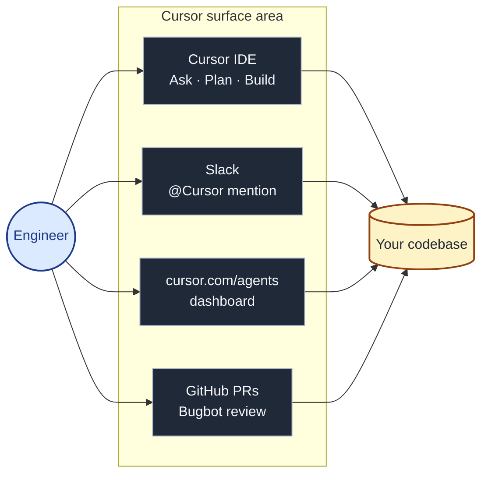
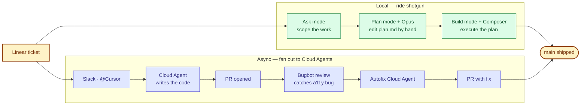

# Demo diagrams

Two Mermaid diagrams sized for slide capture. Both render natively on GitHub — screenshot the rendered version (light or dark) and drop into Keynote / Google Slides.

---

## Diagram 1 — Where Cursor lives (opening slide)

The differentiator-in-one-image: **Cursor is not an editor; it is a surface area.** One engineer reaches the same agent infrastructure from IDE, Slack, the web dashboard, and inside a GitHub PR.

**Narration cue (~15 sec):**
> *"Before we touch any code — this is what makes Cursor different. Claude Code lives in one surface, the terminal. Cursor lives wherever your engineers already are: the IDE for synchronous work, Slack and the web dashboard for async work you fan out to Cloud Agents, GitHub PRs for review through Bugbot. Same agents, same context, four entry points."*

---

## Diagram 2 — Two-track workflow (closing recap slide)

The story you just demoed, compressed into one image. Local Ask → Plan → Build runs alongside async Cloud Agents, both converging on `main`. This is what "punching above your weight" looks like.

**Narration cue (~20 sec):**
> *"That's the picture. One Linear ticket — two parallel tracks. Locally I rode shotgun with the agent: Ask scoped it, Plan with Opus reasoned about the codebase and wrote a plan I could edit by hand, Build with Composer executed it. In parallel, a Cloud Agent fired from Slack delivered Playwright tests, Bugbot caught an accessibility bug the agent introduced, and a second Cloud Agent produced the fix. Two PRs, one engineer, ten minutes. That's the lift a small team gets — without giving up code review or governance."*

---

## How to use these slides

1. Open this file on GitHub: `https://github.com/holdenstirling/firefly-asset-gallery/blob/main/demo-prep/diagrams.md`
2. GitHub renders Mermaid natively — screenshot at retina (Cmd+Shift+4 on macOS, or zoom the browser to 150% first for crisper export).
3. Drop into your deck. Two slides, no extra apps required.
4. If you want PNG/SVG export for higher quality, paste the source into [mermaid.live](https://mermaid.live) and use its export buttons.
